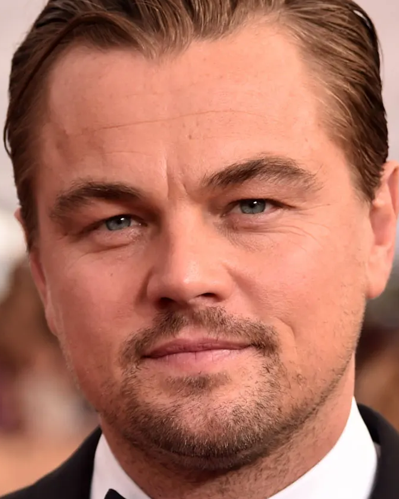

# BindWeave Inference Process

This document outlines the specific inference workflow for the `infer` branch. To optimize memory usage, this process adopts an offline approach by pre-extracting and saving hidden states from the Qwen2.5-VL model before the main inference stage.

The process is broken down into three main steps:

1.  **Prompt Refinement**: Enhance the initial prompt to more accurately describe the subject in the reference image.
2.  **Hidden States Extraction**: Extract and save the hidden states from Qwen2.5-VL.
3.  **Inference**: Run the final inference, loading the pre-computed hidden states as part of the input.

## ⚡️ Quickstart

### Installation
Clone the repo:
```sh
git clone 
cd BindWeave
```

Install dependencies:
```bash
bash build_env.sh
```

## Step 1: Prompt Refinement

Before extracting features, we first refine the original prompt. This step leverages a MLLM to generate a more detailed and descriptive prompt that better captures the key attributes of the subject in the reference image.

**Usage:**

```bash
bash scripts/prompt_refine.sh
```

## Step 2: Hidden States Extraction

> **Important Note on Workflow Independence**
>
> To ensure each workflow (feature extraction, training, inference) remains independent and to avoid conflicts from differing submodule versions, the necessary scripts for this step reside in the `feature_extraction` branch.
>
> We will temporarily switch to that branch to generate the features, and then return to the `infer` branch to use them. 

Follow these steps to generate the hidden states:

1.  **Switch to the `feature_extraction` branch:**
    This branch contains the specialized scripts for feature generation.
    ```bash
    git switch feature_extraction
    ```

2.  **Run the extraction script:**
    Execute the script to process your inference samples and save the hidden state files.
    ```bash
    bash scripts/hiddenstates_extraction.sh
    ```

3.  **Return to the `infer` branch:**
    Once the extraction is complete, switch back to your original branch to proceed with inference. The generated files will remain available.
    ```bash
    git switch infer
    ```

Now you have the required hidden state files and are ready for the next step in the `infer` workflow.


## Step 3: Inference
Before running the inference code, you need to download the 14B original model of Wan2.1, as our BindWeave depends on the Wan2.1 VAE and text encoder:
```bash
pip install "huggingface_hub[cli]"
huggingface-cli download Wan-AI/Wan2.1-I2V-14B-720P-Diffusers --local-dir ./pretrained_model/wanx/Wan2.1-I2V-14B-720P-Diffusers
```
Then download the BindWeave model:
```bash
huggingface-cli download ByteDance/BindWeave --local-dir ./BindWeave_14B
```

#### Weight Conversion
After downloading the BindWeave model, you need to convert the transformer weights to the MM format. Run the conversion script as follows:
```
python convert_ckpt.py \
  --source_path ./BindWeave_14B/ \
  --target_path ./BindWeave_14B/ \
  --mode convert_to_mm
```


Run Subject-to-Video Generation
```bash
bash script/inference_s2v.sh
```
You can modify the corresponding paths in `'BindWeave/configs/inference/inference_model_s2v.json'`, where:
- `BASE_IMG_DIR`: Root directory of the reference images.
- `META_PATH`: Sample JSON file used during inference.
- `OUT_DIR`: Output directory for inference results.


Using the provided sample cases (i.e., the default path configuration), running `bash script/inference_s2v.sh` will produce the following generated results:

<table style="width: 100%; border-collapse: collapse; text-align: center; border: 1px solid #ccc;">
  <tr>
    <th style="text-align: center;">
      <strong>Reference Images</strong>
    </th>
    <th style="text-align: center;">
      <strong>Generated Videos (720P)</strong>
    </th>
  </tr>

  <tr>
    <td style="text-align: center; vertical-align: middle;">
      
      
      
    </td>
    <td style="text-align: center; vertical-align: middle;">
      
    </td>
  </tr>

  <tr>
    <td style="text-align: center; vertical-align: middle;">
      
    </td>
    <td style="text-align: center; vertical-align: middle;">
      
    </td>
  </tr>
  
  <tr>
    <td style="text-align: center; vertical-align: middle;">
      
      
    </td>
    <td style="text-align: center; vertical-align: middle;">
      
    </td>
  </tr>

</table>

> The GIF videos are compressed.